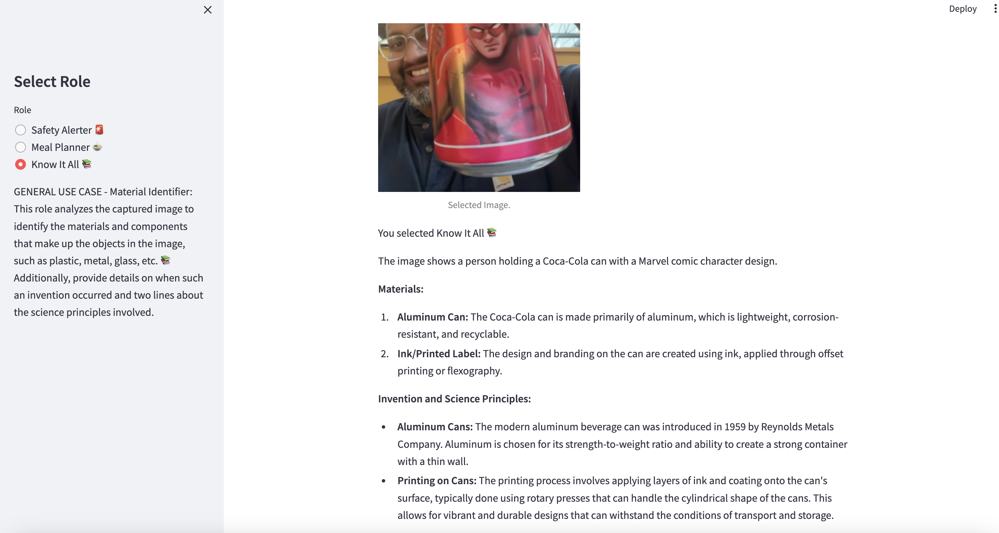

# Role-Based Message and Image Analysis App

This Streamlit app uses OpenAI's GPT-4 model to analyze images based on different roles. The app allows users to either capture an image using their webcam or upload an existing image, and then analyze the image according to the selected role: Safety Alerter, Meal Planner, or Know It All (Material Identifier).

## Features

1. **Safety Alerter 🚨**
   - Analyzes images for any safety violations.
   - Alerts if any violations are found, citing specific safety codes and policies.
   - Provides suggestions on how to avoid the violations.

2. **Meal Planner 🍲**
   - Analyzes images of ingredients.
   - Suggests recipes based on the available ingredients.
   - Provides alternatives if essential ingredients are missing.

3. **Know It All 📚**
   - Identifies materials and components in the image (e.g., plastic, metal, glass).
   - Provides details on when such an invention occurred.
   - Explains the science principles involved.

## Installation

To run this app locally, follow these steps:

1. **Clone the repository:**
   \`\`\`bash
   git clone https://github.com/yourusername/role-based-image-analysis.git
   cd role-based-image-analysis
   \`\`\`

2. **Create a virtual environment and activate it:**
   \`\`\`bash
   python3 -m venv venv
   source venv/bin/activate
   \`\`\`

3. **Install the required packages:**
   \`\`\`bash
   pip install -r requirements.txt
   \`\`\`

4. **Run the app:**
   \`\`\`bash
   streamlit run app.py
   \`\`\`

## Configuration

### OpenAI API Key

Make sure to replace \`'your-openai-api-key'\` in the \`app.py\` file with your actual OpenAI API key.

\`\`\`python
client = OpenAI(api_key='your-openai-api-key')
\`\`\`

## Usage

1. **Select Role:**
   - Choose a role from the sidebar: Safety Alerter 🚨, Meal Planner 🍲, or Know It All 📚.

2. **Upload or Capture an Image:**
   - You can either upload an image file or use your webcam to take a picture.

3. **Analyze:**
   - Click the "Analyze" button to process the image.
   - The app will display the captured/uploaded image and provide an analysis based on the selected role.

## Screenshots

### Safety Alerter 🚨

### Meal Planner 🍲

### Know It All 📚

## License

This project is licensed under the MIT License. See the [LICENSE](LICENSE) file for details.

## Contributing

Contributions are welcome! Please open an issue or submit a pull request for any improvements or bug fixes.

## Acknowledgements

- [Streamlit](https://streamlit.io/)
- [OpenAI](https://openai.com/)
"""
